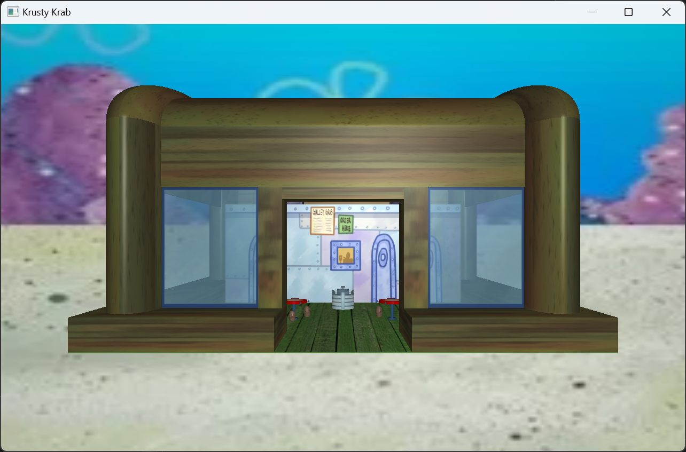
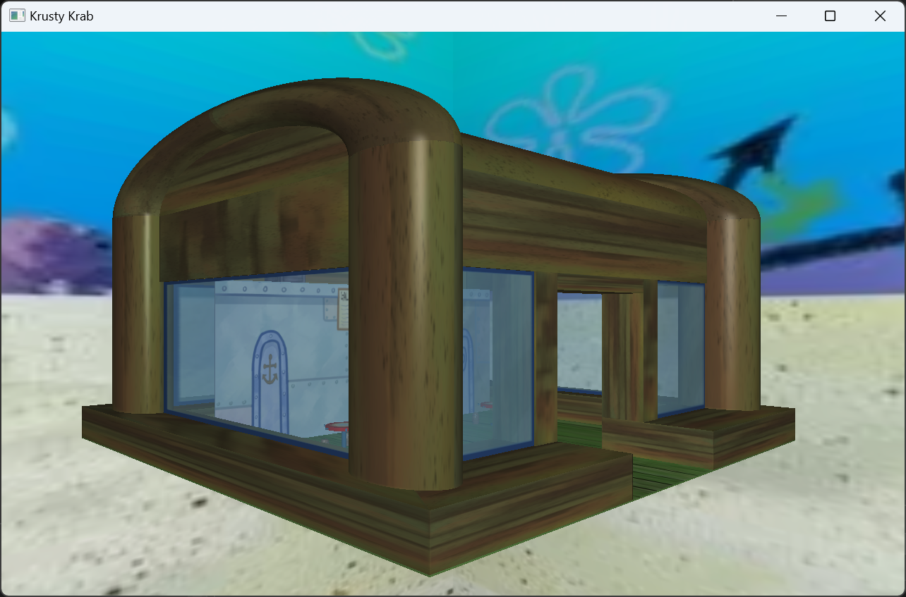
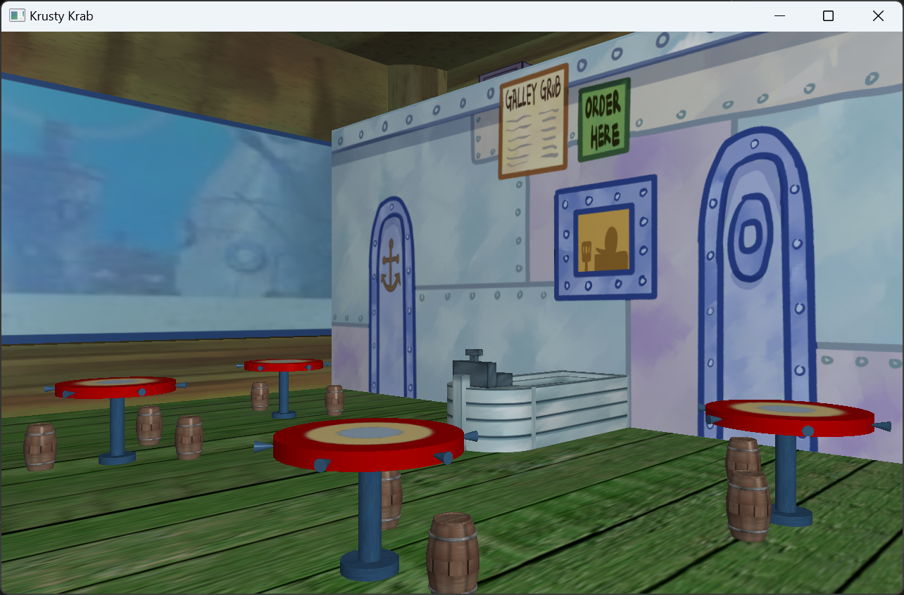
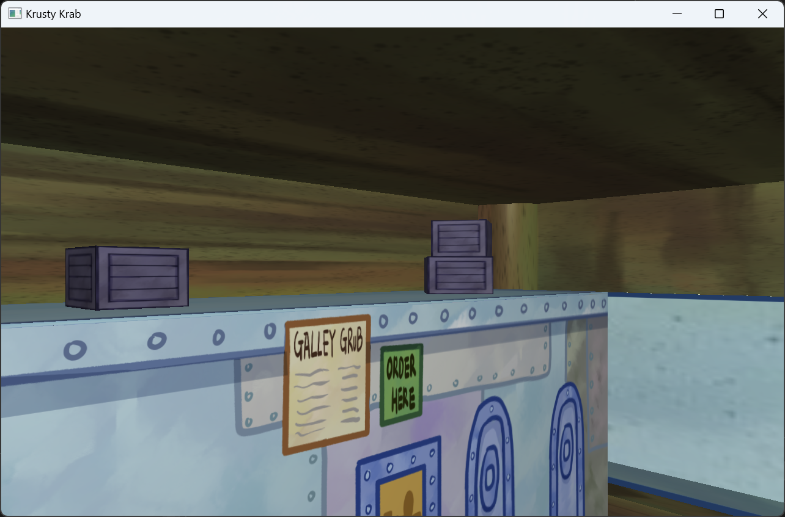
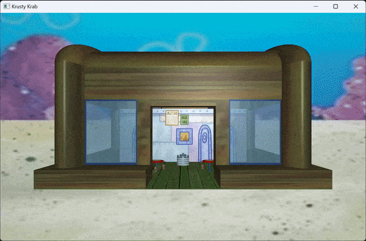
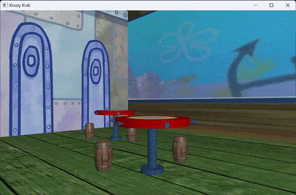

# KrustyKrab

## 基本介绍
本项目使用Qt提供的OpenGL框架还原了动画《海绵宝宝》中的蟹堡王餐厅场景。  
开发环境：Windows11，Visual Studio 2022  

## 交互方式
`↑`键：向上移动镜头  
`↓`键：向下移动镜头  
`←`键：向左移动镜头  
`→`键：向右移动镜头  
`W`键：向前移动镜头  
`S`键：向后移动镜头  
`A`键：向左旋转镜头45°  
`D`键：向右旋转镜头45°  
`Esc`键：退出程序  

## 效果演示
### 静态场景演示
  
  
  
  

### 动态场景演示
  
  